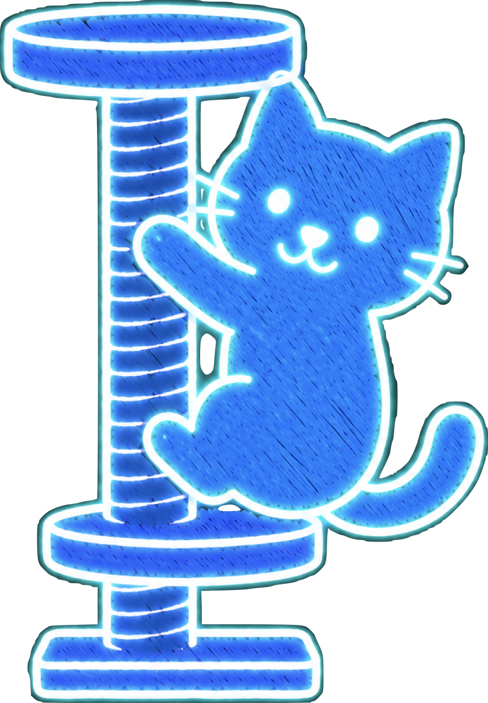
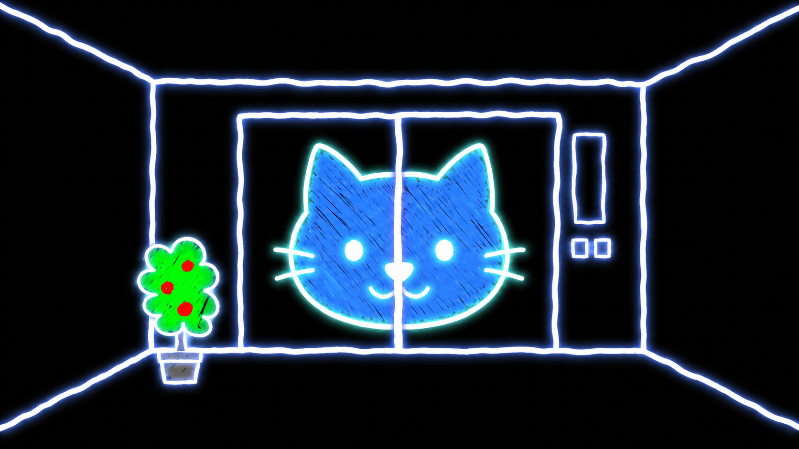
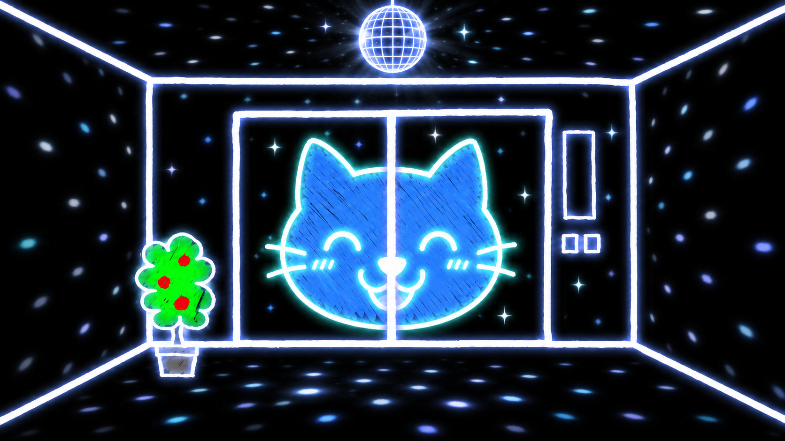
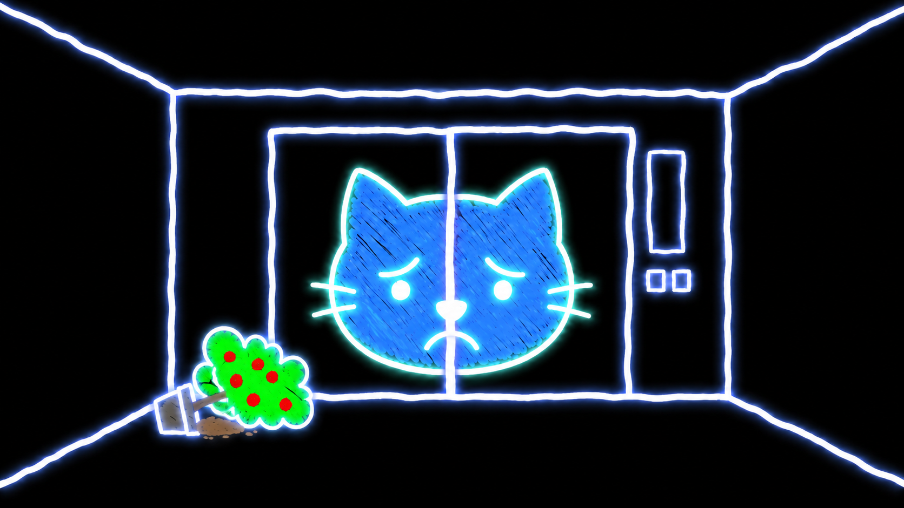
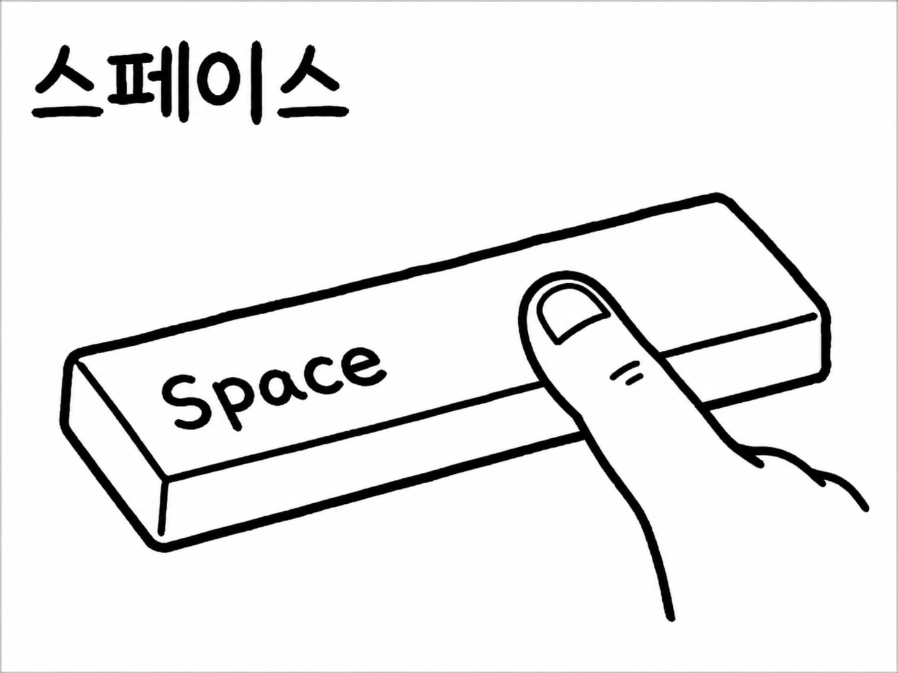
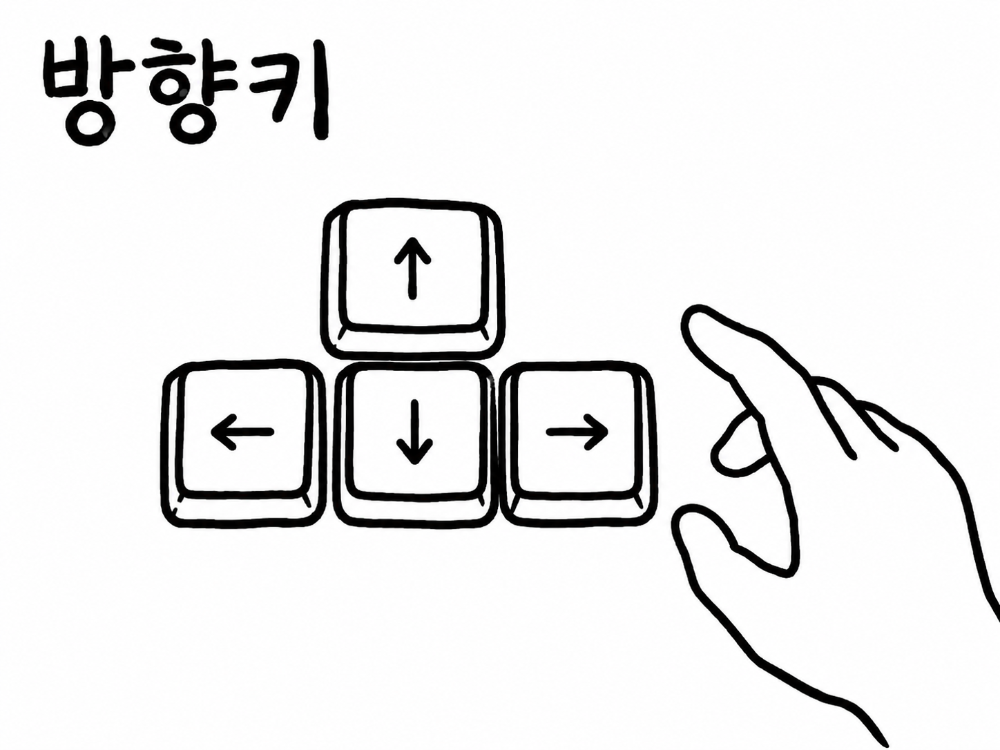
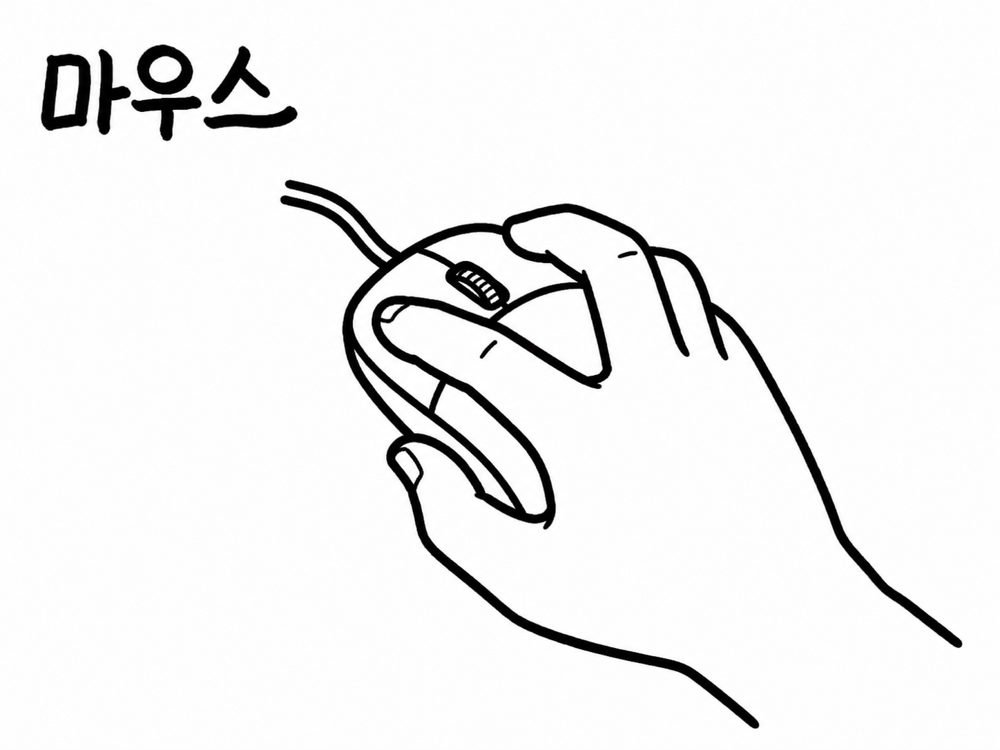
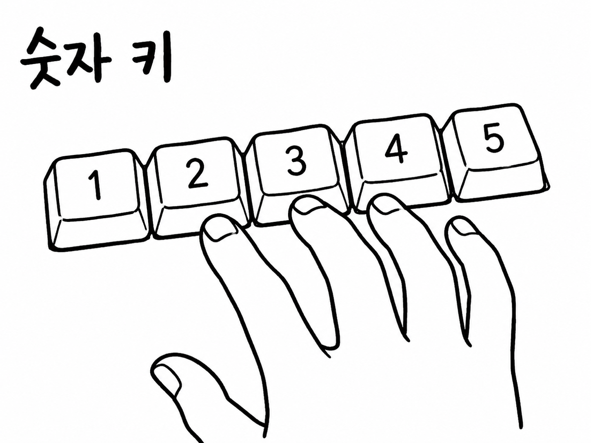

# Microgames Elevator 🛗

<p align="center">
  
</p>

<p align="center">
  음악과 박자에 맞춰 짧은 미션이 빠르게 이어지는 웹 기반 마이크로게임입니다. 순식간에 판단하고, 정확한 타이밍에 입력하고, 더 높은 층까지 살아남으세요.
</p>

<p align="center">
  
  
  
  
</p>

<p align="center">
  
  
  
</p>

## 🎮 프로젝트 소개

Microgames Elevator는 WarioWare 스타일의 짧고 빠른 미션형 게임을 브라우저에서 즐길 수 있게 만든 Next.js 프로젝트입니다. 라운드마다 다른 조작법이 제시되고, 플레이어는 몇 박자 안에 즉시 반응해야 합니다.

현재 빌드에는 일반 라운드, 보스 라운드, 목숨 시스템, 최고 기록 저장, 셋업 전환, 음악 큐, 조작법 안내 화면, 여러 종류의 게임 캔버스가 포함되어 있습니다.

## 🔁 게임 흐름

```txt
에셋 로딩
  -> 메인 화면
  -> 시작 준비
  -> 랜덤 마이크로게임 선택
  -> 박자 제한 입력
  -> 성공 / 실패 판정
  -> 속도와 압박 증가
  -> 12라운드마다 보스 라운드
  -> 게임 오버
```

## 🕹️ 조작 방식

<p>
  
  
  
  
</p>

현재 마이크로게임 레지스트리는 다음 조작을 지원합니다.

- 스페이스바
- 방향키
- WASD
- 방향키 + 스페이스바
- 마우스 클릭
- 마우스 휠 스크롤
- 숫자키
- 한글 키보드 입력
- 마이크 입력 폼

## ⚡ 현재 마이크로게임

| ID | 캔버스 | 조작 | 종류 |
| --- | --- | --- | --- |
| `catch-arrow` | 기본 엘리베이터 | 방향키 | 일반 |
| `jump-gap` | 크롬 공룡 스타일 | 스페이스바 | 일반 |
| `press-button` | Undertale 스타일 | 마우스 클릭 | 일반 |
| `balance-wasd` | 기본 엘리베이터 | WASD | 일반 |
| `scroll-lift` | 기본 엘리베이터 | 스크롤 | 일반 |
| `dash-jump` | 기본 엘리베이터 | 방향키 + 스페이스 | 일반 |
| `code-pad` | 수강신청 번호판 | 숫자키 | 일반 |
| `type-meow` | 기본 엘리베이터 | 한글 키보드 | 일반 |
| `call-cat` | 기본 엘리베이터 | 마이크 폼 | 일반 |
| `boss-emergency-dash` | 기본 엘리베이터 | 방향키 + 스페이스 | 보스 |
| `boss-master-code` | 기본 엘리베이터 | 숫자키 | 보스 |
| `boss-overdrive-lift` | 기본 엘리베이터 | 스크롤 | 보스 |

## 🧰 기술 스택

- Next.js App Router
- React 19
- TypeScript
- Tailwind CSS 4
- 게임 흐름, 리듬, 입력, BGM, 기록 저장을 위한 커스텀 React 훅
- `public/games/*/images`, `public/games/*/sounds` 기반 게임별 정적 에셋

## 🗂️ 프로젝트 구조

```txt
app/                     Next.js 라우트와 전역 스타일
components/game-flow/    화면 흐름, 라운드 UI, 오버레이, 셸
data/                    마이크로게임 레지스트리, 조작법, 프리로드 에셋
games/                   마이크로게임 캔버스 구현
hooks/                   게임 상태, 입력, 리듬, BGM, 기록 저장 훅
lib/                     캔버스와 오디오 헬퍼
public/games/game-flow/  메인 흐름 이미지와 사운드
public/games/forms/      조작법 안내 이미지
types/                   공유 타입 선언
```

## 🚀 시작하기

의존성을 설치합니다.

```bash
npm install
```

개발 서버를 실행합니다.

```bash
npm run dev
```

브라우저에서 접속합니다.

```txt
http://localhost:3000
```

## 📜 스크립트

```bash
npm run dev           # 로컬 Next.js 개발 서버 실행
npm run build         # 프로덕션 빌드 생성
npm run start         # 프로덕션 서버 실행
npm run lint          # ESLint 실행
npm run format        # Prettier로 포맷팅
npm run format:check  # 포맷팅 상태 확인
```

## 🧩 마이크로게임 추가하기

1. `games/`에 새 캔버스를 추가하거나 기존 캔버스를 재사용합니다.
2. `data/microgames.ts`에 라운드를 등록합니다.
3. `data/formInstructions.ts`의 조작법 폼 중 하나를 선택합니다.
4. 필요한 이미지나 사운드를 `public/`에 추가합니다.
5. 짧고 직관적이며 박자에 잘 맞는 미션으로 유지합니다.

## 🔒 라이선스

이 프로젝트는 개인 실험용 비공개 프로젝트입니다.
